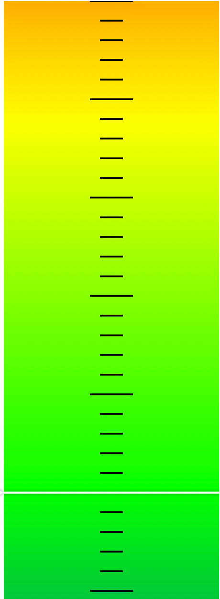

# MyFeelsLike

<!-- INFO_SCREEN_START -->
MyFeelsLike learns how the weather actually feels *to you*, and colors the
forecast by your own comfort instead of a one-size-fits-all "feels like" number.
Rate a handful of moments, and from then on the next 24 hours and 10 days are
shown as *your* colors — on iPhone and Apple Watch.

**In short:** rate how it feels ▸ the app fits a small personal model ▸ the
forecast is colored by your comfort ▸ a thin band means "don't trust this yet".

Each section below is a short summary, followed by the detail.

## Contents
- [The colors](#the-colors) — comfort as a color, not a number
- [Rating how it feels](#rating-how-it-feels) — the few taps that teach the app
- [The 24-hour screen](#the-24-hour-screen) — hourly bands and your comfort band
- [The 10-day screen](#the-10-day-screen) — the trend and a time-of-day heatmap
- [Reading exact values](#reading-exact-values) — long-press any graph
- [When the band goes thin](#when-the-band-goes-thin) — how sure the app is
- [Scenarios](#scenarios) — activity, clothing, sun or shade
- [Comparing with others](#comparing-with-others) — nearby, by link or QR
- [Apple Watch and complications](#apple-watch-and-complications)
- [Settings and units](#settings-and-units)
- [Your data](#your-data) — what stays on your device
- [More](#more) — for developers

## The colors
Comfort is shown as a color — white and blue when it feels cold, green in the
middle, yellow through red as it gets hot — so you can read the forecast at a
glance without thinking in degrees.

### How the scale works
The colors are not tied to fixed temperatures. They are whatever *you* rated as
comfortable or not, so the same green can mean 18 °C for one person and 24 °C
for another.

Colors only appear once the app has enough ratings to estimate your personal
model — usually about five, spread across clearly different weather.

## Rating how it feels
Tap **Rate Feels Like**, scroll the color column until the strip across the
middle shows how this moment feels, then set your activity, clothing and
sun/shade. Save.

### Getting a good model quickly
You must set each of the three choices deliberately; nothing is pre-filled,
because a default left untouched would teach the app something you did not mean.

Variety matters far more than quantity. Ten ratings all taken in the same hot
week teach the app very little, because it cannot tell what came from the
temperature and what came from sun, activity or clothing. A handful of ratings
across clearly cooler *and* clearly warmer weather is worth much more.

While testing, the rating column shows the new colors on its left half and the
previous ones on its right, so you can tell us which you prefer.

## The 24-hour screen
The temperature panel shows the outdoor temperature and the standard
"feels like" as lines. Below it, a band shows your predicted comfort hour by
hour; below that, precipitation and wind.

### What else is on this screen
You can add wet-bulb and dew point, and switch between light **lines** and bold
**filled bands**, in Settings.

Once the app has learned that sun makes a difference for you, the comfort band
splits into an in-sun and an in-shade version, so you can see how much shelter
is worth on a given day.

## The 10-day screen
The same temperature panel stretched over ten days (the recent past drawn
dashed), plus a heatmap of your comfort: one column per day, hour-of-day up the
side, so the good times of day stand out.

## Reading exact values
**Long-press any graph** to drop a line you can drag along the timeline. A card
shows every value for that moment — your comfort score, temperature and feels
like, wet bulb, dew point, wind and gusts, precipitation, cloud and UV. Tap to
dismiss.

### And the table screen
Because the long-press readout gives you the exact numbers anywhere you point,
the full table screen is switched off by default. You can turn it back on in
Settings if you like scrolling a full table.

## When the band goes thin
A thin comfort band means the app is *not confident* about that hour, and a
short label says why — for example "colder than you've rated".

### Why the app holds back
Your model only knows the conditions you have actually rated in. A forecast well
outside them is guesswork, so instead of showing a confident color the band
narrows to a sliver.

Four things can narrow it: an unusual combination of conditions; a value outside
the range you rated (temperature, wind, humidity and so on); a scenario you have
never rated; or a predicted comfort well outside the range of scores you have
ever given.

The cure is always the same — rate a few moments in the kind of weather where
the band is thin.

## Scenarios
Your comfort depends on what you are doing. The chips at the top set your
activity, clothing and sun/shade, and the colors update to match. Only the chips
the app has actually learned to use for *you* are shown.

## Comparing with others
Compare your colors with other people, for the same weather.

### Three ways to share
When you are together, **Connect Nearby** exchanges models directly between the
two devices for a live comparison.

For someone who is not nearby, send a snapshot of your model as a link, a small
file attachment, or a QR code they scan. No account and no server is involved,
and it works to an Android device too. A snapshot does not update when you rate
more — re-send it to share a newer one.

Either way the comparison shows as side-by-side color bands, so you can see how
differently the same day feels to each of you.

## Apple Watch and complications
The watch app shows the same 24-hour and 10-day views, and a complication puts
your current color — split into sun and shade when known — on your watch face.

## Settings and units
Choose °C or °F and 12- or 24-hour time, pick which series the graphs show, and
switch the chart style between lines and filled bands.

### The rest of Settings
**Muted colors** softens the weather lines for a gentler look. You can show or
hide the **table** screen, turn the weather-sky background on or off, set the
name others see when comparing, and choose whether to share anonymous data with
the developer.

**Fold timeline** is experimental: it replaces the two graph screens with a
single one you swipe to morph from the 24-hour view into the 10-day heat map.

## Your data
Your ratings and your personal model stay on your device.

### Exactly what goes where
They are **not** synced across your devices — each iPhone or iPad keeps its own
ratings and its own model.

Nothing leaves your device unless you turn on **Share data with developers**
(off by default), which uploads only anonymized ratings and model coefficients —
no name, no location, no place.

## More
[Developer documentation on GitHub](https://github.com/dutch-rob/MyFeelsLike/blob/main/ARCHITECTURE.md)
<!-- INFO_SCREEN_END -->

---

## Building it yourself

MyFeelsLike is a native SwiftUI app for iOS + watchOS.

**Requirements**
- Xcode 16 or later (the project uses file-system–synchronized groups).
- An Apple Developer account, because the app uses **WeatherKit** (enable the
  WeatherKit capability on the App ID) and, for the optional data-sharing
  feature, **CloudKit**.

**Run it**
1. Open `MyFeelsLike.xcodeproj`.
2. Select the **MyFeelsLike** scheme and a simulator or device, and run. The
   watch app and the complication build from their own schemes.

**Capabilities**
- **WeatherKit** — required; the app fetches forecasts from Apple.
- **App Groups** (`group.robotex.MyFeelsLike`) — shares the complication snapshot
  between the watch app and its complication.
- **CloudKit** (`iCloud.robotex.MyFeelsLike`, phone target only) — only used when
  a user opts in to *Share data with developers*.

**Note (iCloud Drive):** if you keep the repo in iCloud Drive, incremental builds
can miss changes because iCloud rewrites file timestamps — `touch` the changed
`.swift` files before building if a change doesn't seem to take.

## Architecture and contributing

- [`ARCHITECTURE.md`](ARCHITECTURE.md) — how the app is put together (data flow,
  the personal-comfort model, the sync paths).
- [`CONTRIBUTING.md`](CONTRIBUTING.md) — conventions, tests, and how to work on it.
- [`PRIVACY.md`](PRIVACY.md) — exactly what data the app handles and where it goes.

The in-app **Info** screen (Settings ▸ Info) is generated from the section of this
file between the `INFO_SCREEN` markers — edit the text here and run
`python3 tools/generate_infoview.py` to regenerate `MyFeelsLike/InfoView.swift`.

## License

MyFeelsLike is licensed under the **GNU General Public License v3.0 or later**.
See [`LICENSE`](LICENSE).
